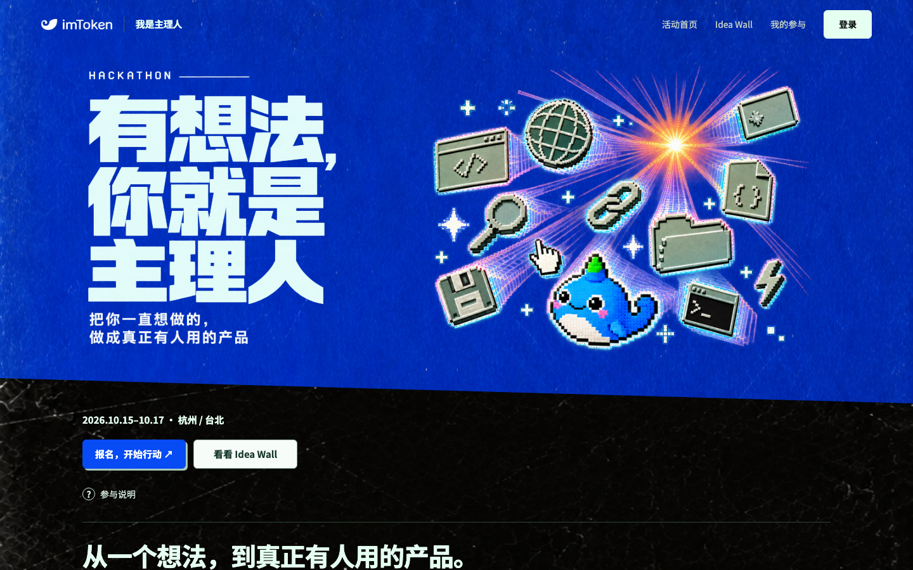

# case-bossgame · 真实案例：「我是主理人」活动站改版

> **素材类型：真实项目记录。** 2026-09-10 ~ 09-11，两个工作日，Wilson 用 Claude（Cowork + agent + Claude Design + Figma MCP）把 Mkt 做的活动站 bossgame.pages.dev 重新设计成一套可交付的设计体系。
> 这份 README 只做**索引 + 映射**：告诉你原文在哪、对应本课的哪一步。原文不在这里复制，放在资料包根目录的 `我是主理人/`（和 `design-kit/` 同一级；相对本文件是 `../../我是主理人/…`）：五份 Markdown 原文 + `handoff/` 里改版后的交付包，下面每个链接都能直接点开。
> 为什么放进参赛资料：它是本课方法在一个真实项目里的完整样本 —— 同样是先写清需求、再生成、每轮只改一处、上线前自查，只是讲者本人是设计师，有几步他自己做了，而你可以交给 AI。

## 0 · 前后对照

| 改版前 · Mkt 现站首屏（1440×900） | 改版后 · handoff `index.html` 首屏（1440×900） |
|---|---|
|  |  |

截图里能直接指认的五处变化，每一处都能追到一条写下来的规则：

| # | 改版前（截图里看得到） | 改版后 | 依据（原文位置） |
|---|---|---|---|
| 1 | 眉标 `HACKATHON` | `IMTOKEN 内部 · 2026.10.15–17 · 杭州 / 台北` | 走查 A1（P0 定位矛盾）· DESIGN.md §7 眉标格式 |
| 2 | 主张「有想法，你就是主理人」（条件句） | 「不是~~团建~~，不是~~黑客松~~，你是主理人」（判断句 + 划线） | DESIGN.md §7「主张用判断句」· 分享 §6 第 7 条 |
| 3 | 标题是一张 PNG，选不中 | 真实文本，可选中复制 | 走查 C8 · DESIGN.md §2.1 · AI_PROMPT 验收第 6 条 |
| 4 | 蓝底 + 黑色 grunge + 像素图标，站内四套视觉语言 | 浅色玻璃一套：`#F6F9FE` 地色 + 白玻璃 + 线性图标 | 视觉方向讨论稿 §1 · DESIGN.md §0 / §3.1 / §8 |
| 5 | 首屏只有日期和两个按钮 | 四个 chip 把「两天半 · 全员投票 · 落地大礼包 · 赛后 90 天生死线」提到首屏 | 走查 A2（决策所需信息全部缺失） |

一个真实的不一致，值得讲：DESIGN.md v1.0（09-11）§5.7 写的是吉祥物「只用矢量版、不用位图」，而分享 §4 步骤 ⑦ 之后首屏换成了素材库的 3D Bulu（720px WebP）。**体系文件落后于实现**是常态 —— 所以本课要求改了方向就在 DECISIONS.md 记一行、同步改 style-lock。

## 1 · 原始材料索引

| 文件 | 是什么 | 什么时候打开 | 先看哪里 |
|---|---|---|---|
| [分享_用ClaudeDesign把网站做得还不错_工作流与Prompt模板.md](../../我是主理人/分享_用ClaudeDesign把网站做得还不错_工作流与Prompt模板.md) | 全案复盘：七步流程、三个角色、十条原则、六个 Prompt 模板、踩坑 | 想知道「一个真项目怎么从头跑到尾」 | §2 产出清单（第 54 行）· §4 七步（第 99 行）· §8 模板（第 270 行） |
| [bossgame_IA与功能走查反馈_给Mkt_2026-09-11.md](../../我是主理人/bossgame_IA与功能走查反馈_给Mkt_2026-09-11.md) | 给 Mkt 的事实清单：27 条，每条「位置 / 现状 / 期望 / 修复」，P0/P1/P2 | 你手上有七成产品，要写能被 AI 直接执行的反馈 | §0 先决事项（第 15 行）· A1 示范写法（第 29 行）· E 验收清单（第 207 行） |
| [bossgame_视觉方向讨论稿_内部_2026-09-11.md](../../我是主理人/bossgame_视觉方向讨论稿_内部_2026-09-11.md) | 四套视觉语言的诊断 + A/B/C 三个方向 + 选择理由 | 团队在第 2 步争「选哪个方向」 | §3 三个方向 · §4 判断「A 为主，吸收 C 的目标卡」 |
| [handoff/DESIGN.md](../../我是主理人/handoff/DESIGN.md) | 设计体系约束 v1.0，240 行：token、字体层级、玻璃材质 CSS、组件、动效、禁用清单、自查表 | 想看一份「写到底」的 style-lock 长什么样 | §0 三条原则（第 10 行）· §8 禁用清单（第 213 行）· §9 自查表（第 228 行） |
| [handoff/AI_PROMPT_改造现站.md](../../我是主理人/handoff/AI_PROMPT_改造现站.md) | 给另一个团队的 AI 工具的改造指令：三轮（内容 → UI → 功能）+ 十条验收 | 要把你的设计交给队友或别的团队的 AI 去实现 | §2 不可妥协的规则（第 28 行）· 发送前要填的空（第 103 行）· 验收十条（第 109 行） |

改版后的独立交付包也在资料包里，双击 HTML 就能打开（图片在同目录 `assets/`，别把 HTML 单独拷走；联网时加载 Google 字体，不联网回退到系统字体）：

| 文件 | 是什么 | 看什么 |
|---|---|---|
| [handoff/index.html](../../我是主理人/handoff/index.html) | 改版后的活动站，上面「改版后」截图就是它的首屏 | 对着 §0 五处变化逐条找；把窗口拉到手机宽看响应式；标题能选中复制（第 3 处） |
| [handoff/kv.html](../../我是主理人/handoff/kv.html) | 主视觉 KV，1920×1080 固定画布 | 对应 §2 第 ⑦ 步「主视觉回流」：浏览器窗口设成 1920×1080 截图就是成图 |
| [handoff/assets/](../../我是主理人/handoff/assets/) | 图片：吉祥物 Bulu（页面用 `bulu.webp`；`bulu-720.png` 页面没引用，是 PNG 版）、logo `imtoken-logo.png`、分享图 `og.png`（index.html 的 og:image） | 吉祥物位图就是 §0 末尾说的「体系文件落后于实现」那一处 |

## 2 · 原文七步与本课六步的对应

原文 §4（第 99 行）的七步，和本课的对应关系：

| 原文七步（角色） | Wilson 实际做了什么 | 本课对应 | 你要做的事 | 差别 |
|---|---|---|---|---|
| ① 吸收上下文（导演） | AI 读 39 页 deck、跑现站 5 个路由、载入 DS token，约 1 小时 | 第 1 步 · 写清需求：Prompt 00a → PRODUCT.md | 回答七个问题 | 他的「事实」在 deck 和现站里；你的事实在你脑子里，所以由 AI 问七个问题把它问出来 |
| ② 分层诊断（导演） | IA/功能 与 视觉 分两份文档；视觉出 A/B/C 三方向 | 第 2 步 · 找参照、定风格：Prompt 02 三个方向（可选）；已有产品的团队从第 4 步开始 | 挑一个参照 | 他自己判断「现站在讲一个错误的故事」；你用参照来定方向，判断交给评委 AI |
| ③ 写 Brief（体系作者） | 22 KB 的 BRIEF.md + 后来的 DESIGN.md | 第 1–2 步的产物：PRODUCT.md + style-lock.md | 回答问题，挑参照 | 他亲手写规则；你只需挑一张参照、回答三个问题，规则由 AI 来写（Prompt 00b） |
| ④ 委派构建（编辑） | 300 字委派指令，agent 30 分钟出三个 artboard | 第 3 步 · 生成首版：Prompt 04 | 把首版点一遍 | 同一个要点：「不要自行发挥 · 示例数据要标注 · 回报偏差」↔ Prompt 04「先复述 · 不要问我 · 告诉我哪些没做」 |
| ⑤ 复查（编辑） | 只看截图：署名重复 → 改一处；浮块压面板 → 判断成立不改 | 第 3 步真的点一遍 + 第 4 步 · 评审迭代：Prompt 05 / 06 | 点一遍，从三条意见里选一条 | 「改一处」就是 Prompt 06；「判断不改」就是三条批评里**没选**的那两条 |
| ⑥ 转交付物（体系作者） | 一份设计三种形态：画布 / 独立 HTML / DESIGN.md / 给对方 AI 的 Prompt | 第 5 步 · 上线前检查：Prompt 09 审计（DESIGN.md §9 自查表 ↔ 34 项审计）；三层安装 L1/L2/L3 | 对照清单检查 10 项 | 他为三种消费者分别打包；你只需要保证队友的 AI 读的是同一份 PRODUCT.md + style-lock.md |
| ⑦ 主视觉回流（导演 + 体系作者） | Figma MCP 画 KV，参数回写网站 hero | 第 6 步 · 包装呈现：Prompt 07 主视觉 | 从几张主视觉里选一张 | 共同原则：主视觉是「一处戏剧」，体系稳定之后再加（原文第 177 行）↔ DAY-PLAN 把它排在 Day 3 |

**一句话：** 七步里真正需要设计师的是 ②③ 两步的「判断」和「写规则」。本课把判断交给参照和评委 AI，把写规则交给 AI 从参照里提取，你要做的是回答问题、挑参照、把原型点一遍、从评委意见里选一条。

## 3 · 原文三个角色在本课由谁承担

原文 §3（第 79 行）：导演决定讲什么故事，体系作者把品味写成规则，编辑只看结果、只改偏差。

| 原文角色 | 原文里的一个具体动作 | 本课由谁做 | 你要做的事 |
|---|---|---|---|
| 导演 Director | 「AI 会告诉你首页有哪些区块，不会告诉你首页在撒谎」—— 发现 HACKATHON 眉标与定位矛盾 | 你 | 第 1 步回答七个问题，其中「用户 / 时刻 / 任务 / 绝不能」就是你的故事；第 2 步挑一个和你的产品气质接近的产品做参照 |
| 体系作者 Systems Author | 把「轻且透」翻成 `rgba(255,255,255,.58)` + `blur(20px)` + 第二强调色 ≤ 5% | **AI**（Prompt 00b 写 style-lock.md） | 读 AI 复述的三句「这个风格的核心是…」，像就往下，不像就换一张参照 |
| 编辑 Editor | 看截图：署名重复就改一处；浮块重叠判断成立就不改 | 你 + 评委 AI | 第 3 步把原型真的点一遍；第 4 步从三条批评里选一条，交给 Prompt 06 |

原文最重要的一句提醒（§3.3 下方，第 95 行）：「你最容易掉进的坑是全程当 Editor —— AI 生成什么你改什么。」本课把写清需求、找参照排在生成和评审之前，就是为了避开这个坑。

## 4 · DESIGN.md ↔ style-lock.md：它就是一份写到底的 style-lock

style-lock.md 是九行；DESIGN.md 是 240 行。逐行对照：

| style-lock.md（`../templates/style-lock.md`） | DESIGN.md 对应节 | 这一行在真实项目里写到多细 |
|---|---|---|
| 参照物 + 1 参照锚点 | 文件头「基底：imToken Web DS」· §2.3「与 All Hands deck 的唯一显式连接」 | 参照不止一个：DS 管 token，deck 管气质，只借展示数字这一个元素 |
| 人格 · 生成前复述三句 | §0 三条原则：呼吸感优先 · 轻且透 · 只有一处戏剧 | **§0 就是三句复述的成品** |
| 2 形状语言 | §3.2 圆角刻度 4/8/12/16/20/24/999 · §3.3 只有两种描边 | 连「不用 6、10、14 这类中间值」都写了 |
| 3 字体系统 | §2 字族只有两个 + 13 级字号表（桌面 / 手机） | 标题必须是真实文本，不许图片 |
| 4 色彩策略 | §1 token 表（允许用途 / 禁止用途两列）· §1.2 第二强调色「第 5 处就是超标」· §1.3 灰字用 navy 透明度 | 每个颜色都写了「不许用在哪」 |
| 5 密度与留白 | §0 原则 1 · §4 分区上间距 112 / 88 / 72，正文行宽 ≤ 640 | |
| 6 层次表达 | §3.1 玻璃（给出完整 CSS）· 阴影永远是 navy 透明度 | 一级 `.glass`、二级 `.glass-lite`，不嵌套 blur |
| 7 动效性格 | §6 只允许入场 / 常驻 / 反馈三类，给出时长与缓动 | 明确禁止滚动触发、视差、粒子 |
| 8 图像与材质 | §5.6 图标 · §5.7 吉祥物 · §5.8 logo | 吉祥物只允许出现在 4 个位置 |
| 9 禁止项 | §8 禁用清单 10 条 | 出现任意一条即不合格 |
| （style-lock 没有） | §5 组件规格 · §7 内容与语气 · §9 交付前自查 | 分别对应本包 Skill `states` / `copy-review` / `design-audit` |

两点提醒：

- **禁止项是跟产品走的。** style-lock 模板默认禁止「紫→蓝渐变首屏 + 玻璃卡片」，而 bossgame 的整套体系就是玻璃。不矛盾：模板禁的是没有锚点的 AI 默认值；bossgame 的玻璃有 DS 做锚点、有完整 CSS 数值、有「不嵌套」的规则。能写出数值的风格，就不是 AI 味儿。
- **你不需要写到 240 行。** 三天里九行够用。首版稳定后如果要交给队友或另一个 AI 实现，可以让 AI「按 DESIGN.md 的节结构，把 style-lock 扩写成完整体系」，再用它的 §9 格式生成你自己的自查表。

## 5 · 六个 Prompt 模板：什么时候用

全部在原文 §8（第 270 行起）。原文 §7.1（第 237 行）的「七段结构：角色 → 背景 → 输入 → 不可妥协 → 规格 → 验收 → 回报格式」和本包 PROMPT-PACK 的「任务包」是同一个意思。

| 模板 | 一句话：什么时候用 | 原文位置 | 本包里的对应 |
|---|---|---|---|
| A · 设计 Brief | 要让 agent 一次做出多页 / 多尺寸，而且全部文案已定；两份文件不够装时用它合成一份 | §8 模板 A · 第 272 行 | PRODUCT.md + style-lock.md 的合订长版 |
| B · 委派指令 | 在 Claude Code / Codex / Cursor 里启动一个 agent 按文件构建，只写 300 字、只指向文件 | §8 模板 B · 第 318 行 | Prompt 04 |
| C · 走查 / 诊断 | 已有七成产品：产出「位置 / 现状 / 期望 / 修复」的问题清单，能直接交给 AI 逐条改 | §8 模板 C · 第 332 行（成品示例：走查反馈全文） | Prompt 05 · 09 |
| D · 转交付物 | Day 3 前：把 Artifact / 画布转成双击能打开的单文件 HTML，给队友或部署用 | §8 模板 D · 第 351 行 | — |
| E · 给外部团队 AI 的改造 Prompt | 设计要交给另一个人的 AI 工具实现（前端队友、另一个团队）；自包含、分三轮、带验收 | §8 模板 E · 第 362 行（成品示例：handoff/AI_PROMPT_改造现站.md） | AGENTS.md（L2） |
| F · Figma 主视觉绘制 | 只在你有 Figma MCP 写入权限、又要矢量可编辑的主视觉时；否则用 Prompt 07 | §8 模板 F · 第 384 行 | Prompt 07 |

写 Prompt 的六条经验在 §7.3（第 259 行），其中和参赛者最相关的是第 3 条「示例数据必须标注」和第 6 条「留空比猜好：用 `{{ }}` 标出来让人填，不让 AI 编」。

## 6 · 时间账

原文 §2 末尾（第 75 行）：

> 两个工作日内的实际交互时长约 8 小时，其中我自己动手的时间（写 brief、判断方向、复查、写文档）约 4 小时，agent 构建与验证约 3 小时，Figma 绘制约 1 小时。

原文里散落的分项：吸收上下文约 1 小时（§4 ①）· 现站走查 40 分钟（§1.2）· 写 Brief 40 分钟（§4 ③）· agent 首轮构建 30 分钟（§4 ④）· 为 logo 与吉祥物「迂回」20 分钟（§9.3）。其余未分项。

放到三天赛程里读：

| 原文 | 你的对应时段（DAY-PLAN） | 注意 |
|---|---|---|
| 定义（上下文 + 走查 + Brief）≈ 2 小时 20 分 | Day 0 晚 30 分钟（写清需求 + 找参照）+ Day 1 上午用 Refero 补参照 | 他要读 deck、现站、DS；你只有七个问题和一张参照，所以短得多 |
| agent 首轮 30 分钟 | Day 1 下午 v1 | 等待时不看屏幕，做下一件需要人的事（原文：他在等 agent 时去想主视觉方向） |
| 复查 + 改一处 | Day 2 三轮评审迭代 | 每轮只改一处 |
| Figma 主视觉 1 小时 | Day 3 上午主视觉 | 体系稳定后再做 |

最该带走的比例：**他自己动手的 4 小时里，大头花在「定义」和「判断」，不在「执行」。**

## 7 · 对参赛者最有用的五个坑（原文摘录）

**1. 自信的错误** —— §4 步骤 ②（第 124 行）

> 走查时发现培训日期 deck 和现站对不上（我自己那场到底是 9/24 还是 9/30）。我没有猜，把它作为「先决事项」放在文档第 0 节。**AI 时代最危险的不是错误，是被自信地生成出来的错误。** 没定的信息，宁可留空。

用在你身上：Demo 里的用户数、费率、合作方，没定就留空或标「示意」，别让 AI 编一个像真的数字。

**2. 热心的补充** —— §11「要防的」（第 472 行）

> **热心的补充**：AI 会加你没要的段落、动效、颜色。对策：「不要做的事」清单 + 「顺序固定不许增删」。

用在你身上：style-lock 的禁止项至少 5 条；评审迭代时用 Prompt 06「只改一处，其他任何像素不动」。

**3. 体系漂移** —— §11「要防的」（第 473 行）

> **体系漂移**：改到第五轮时，颜色悄悄多了两个。对策：`DESIGN.md` §9 自查表，每次交付前勾一遍。

用在你身上：Day 2 三轮评审迭代之后必跑一次 Prompt 09 审计，不要只在上台前跑。

**4. 让 agent 自查，偏差要回报** —— §9.2 踩坑表（第 429 行）

> agent 的画布高度按 Brief 写的 6400 | FAQ 之后被裁掉 | agent 自查发现并改为 7600，回报里标注为偏差——这是「让 agent 自查」的价值

用在你身上：Prompt 04 最后那句「告诉我哪些状态做了、哪些没做、哪一条没做到」不能删 —— 它就是在要这份偏差回报。

**5. 导出图会掉字体** —— §5.3（第 197 行）

> **PNG/PDF 导出不嵌入 Google Fonts**：导出图里中文会回退到系统字体，正式物料要从 Figma 出。

用在你身上：Pitch 封面和海报导出后在另一台电脑打开看一眼中文字体；不对就截高清图或从设计工具导出。同一节还有一条组队时一定会遇到的：「两人同时编辑会冲突……适合『一人主编』的模式」（第 199 行）。

## 8 · 讲者：课上在哪三处引用这个案例

| 本课位置 | 引用什么 | 30 秒口播要点 |
|---|---|---|
| 第 2 步 · 找参照、定风格 | 视觉方向讨论稿 §3–§4 | 三个方向 AI 都画得出来；「A 为主、吸收 C 的目标卡」是在已有方向里做选择，不是自己从头画 |
| 第 4 步 · 评审迭代 | 分享 §3.3 / §4 ⑤ | 署名重复，就改一处；浮块重叠，判断设计成立，就不改。从意见里选一条时，也可以决定「这条不改」 |
| 第 5 步 · 上线前检查 | DESIGN.md §9 + 本 README §0 的五处变化 | 每处变化都能对应到一条规则；对应不到规则的改动，就是体系开始漂移的信号 |

## 标注

- 截图：两张 1440×900 首屏，改版前为 Mkt 现站、改版后为 [handoff/index.html](../../我是主理人/handoff/index.html)，由资料包维护者提供，未经本 README 重新截取。
- 原文中的 Claude Design 画布、Figma 链接需要公司账号权限，参赛者不一定打得开；上面每一条映射都只依赖本地 Markdown 原文。
- 行号按 2026-09-24 本地版本；原文更新后以节号为准。
